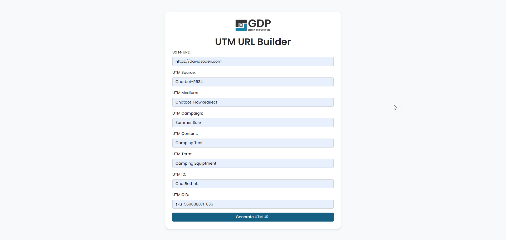

# UTM Builder

## What is UTM Builder?

UTM Builder is a simple tool for generating UTM tracking codes for your marketing campaigns. With UTM Builder, you can easily create and manage UTMs for your campaigns, making it easier to track your marketing efforts and optimize your strategy.

## Key Features

* Easy UTM code generation
* Campaign tracking and analytics
* Customizable templates

## How it Works

1. Simply enter your campaign details, select your desired UTM parameters, and generate your tracking code.

## Getting Started

To get started with UTM Builder, simply:

* Clone the repository
* Install the dependencies
* Run the application locally

## Contribute

UTM Builder is an open-source project, and we welcome contributions from the community. If you'd like to get involved, please:

* File an issue
* Submit a pull request
* Contact us directly

## License

UTM Builder is licensed under the MIT License.

## Acknowledgments

* David Soden
